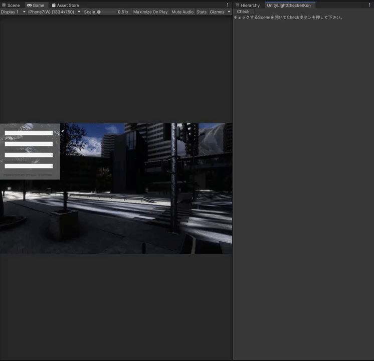

# UnityLightCheckerKun
## 概要
UnityのProjectにおけるLightに関する問題をチェックするEditor拡張です。
チェックしたいシーンを開いてCheckボタンを押すだけでLightに関する各種問題をチェックしレポートします。

# 動作確認環境
- Unity2019.3.6f1
# セットアップ
UnityプロジェクトのAssetsフォルダの直下にUnityLightCheckerKunのフォルダを配置するだけです。
# 使い方
- チェックを行いたいSceneを開く
- Window -> UnityLightCheckerKun で UnityLightCheckerKunを起動
- Checkボタンを押す
以上です。（Scene内に配置されているオブジェクトが多いと多少時間がかかる場合があります。)
